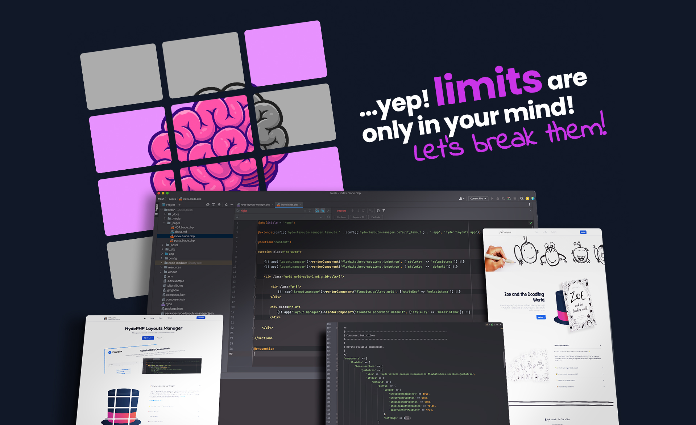

# HydePHP Layouts Manager

**Simplify layout and component management in your HydePHP projects.**

HydePHP Layouts Manager is a powerful package designed to simplify the management of layouts and reusable components in your [HydePHP](https://hydephp.github.io/) projects. It provides an intuitive way to organize and customize themes, layouts, and components with centralized presets and easy override, enhancing your workflow while keeping your codebase clean and maintainable.



**Check it out in action:** [HydePHP Layouts Manager](https://hydephp.melasistema.com)

## 🌟 Features

-   **Dynamic Layout Management**: Seamlessly switch and manage layouts across your HydePHP site for a consistent and adaptable design.

-   **Reusable Components**: Craft modular, customizable components with intuitive default attributes, enabling flexibility and reuse.

-   **Font Manager**: Typography is more than text—it's the voice of your design. With access to 1,790 font families from Google Fonts, you can shape the personality of your site to reflect your identity. Let every word speak volumes, with fonts tailored to inspire, inform, or captivate.

-   **CLI Tools**: Streamline your workflow with powerful commands for listing layouts, merging configurations, and automating essential tasks.

-   **Built-in Flowbite Support**: Enhance your site with beautiful, pre-designed components from the [Flowbite](https://flowbite.com/) library, perfectly integrated for ease of use.

-   **Customizable Themes**: Transform and extend your layouts with fully customizable themes, tailored to your vision.

## 📋 Requirements

Before installing this package, make sure your project meets the following prerequisites:

### Core Requirements

-   **HydePHP Framework**: This package is specifically designed for projects built with [HydePHP](https://hydephp.github.io/). Ensure you are using version `^1.7` or higher.
-   **PHP Version**: Your project must be running PHP 8.1 or newer to guarantee compatibility with both HydePHP and this package.
-   **Composer**: Ensure that Composer is installed and configured in your development environment for dependency management.

### Font Manager Requirements

-   **Internet Connection**: An active internet connection is essential for the Font Manager to dynamically fetch font families from Google Fonts.
-   **Environment Configuration**: Set the `DEFAULT_LAYOUT` variable in your `.env` file to ensure the correct fonts are applied and mapped based on your selected layout. This allows centralized and dynamic typography management.

----------

### Why These Requirements Matter

These prerequisites ensure that the package functions as intended, especially for dynamic font management, layout switching, and integration with HydePHP. Proper setup guarantees a seamless and feature-rich experience.

----------

## 🛠️ Installation

### 1. Install via Composer

Use Composer to add the package to your project:

```bash
composer require melasistema/hyde-layouts-manager
```

----------

### 2. Set the Default Layout in `.env`

To ensure the package works as intended, add the `DEFAULT_LAYOUT` variable to your project's `.env` file.
This value is critical for enabling dynamic typography management.

```env
DEFAULT_LAYOUT=melasistema
```

You can change this value to `hyde` or any custom layout defined in HydePHP Layouts Manager. Refer to the [README Usage Section](https://github.com/melasistema/hydephp-layouts-manager/blob/master/README.md/#usage) for more details.

----------

### 2. Publish the Configuration

Publish the package's configuration file to your app's `config` directory for customization:

```bash
php hyde vendor:publish --provider="Melasistema\HydeLayoutsManager\HydeLayoutsManagerServiceProvider" --tag="hyde-layouts-manager-config"
```

----------

### 3. Merge Tailwind Configuration

#### **Manual Merge**

Manually include the Layouts Manager configuration in your `tailwind.config.js` file:

```javascript
const defaultTheme = require('tailwindcss/defaultTheme');
const HydeLayoutsManagerConfig = require('./tailwind-layouts-manager.config.js');

module.exports = {
    darkMode: 'class',
    content: [
        './_pages/**/*.blade.php',
        './resources/views/**/*.blade.php',
        './vendor/hyde/framework/resources/views/**/*.blade.php',
        ...HydeLayoutsManagerConfig.content,
    ],
    safelist: [
        ...HydeLayoutsManagerConfig.safelist
    ],
    theme: {
        extend: {
            typography: {},
            colors: {},
            ...HydeLayoutsManagerConfig.theme.extend,
        },
    },

    plugins: [
        require('@tailwindcss/typography'),
        ...HydeLayoutsManagerConfig.plugins
    ],
};
```

#### **Automated Merge**

Automate the process with the `tailwind:merge` command. This replaces your existing `tailwind.config.js` file with the default configuration from HydeLayoutsManager.

**⚠️ Warning:** This will overwrite your existing file. Back it up if you have custom configurations.

Run the command:

```bash
php hyde tailwind:merge
```

----------

### 4. Install Required JavaScript Dependencies

The default theme and components shipped with HydeLayoutsManager use **Flowbite**. You can add these dependencies manually or by using the `package-json:merge` command.

#### **Manual Installation**

Add the following Flowbite dependencies to your `package.json` file:

```json
"devDependencies": {
  "flowbite": "^2.5.2"
}
```

Then, install the dependencies:

```bash
npm install
```

#### **Automated Merge**

Use the `package-json:merge` command to automatically merge the Flowbite dependencies into your existing `package.json`.

**⚠️ Safe in Fresh Projects:** This command modifies your `package.json`. Ensure to back it up if you have custom dependencies.

Run the command:

```bash
php hyde package-json:merge
```

Afterward, run:

```bash
npm install
```

----------

### 5. Add Flowbite Styles and Scripts to Laravel Mix Webpack

Add Flowbite styles and scripts in you `webpack.mix.js` file:

```js
let mix = require('laravel-mix');

mix.css('node_modules/flowbite/dist/flowbite.css', 'app.css')
    .js('node_modules/flowbite/dist/flowbite.js', 'app.js')
    .js('resources/assets/app.js', 'app.js')
    .postCss('resources/assets/app.css', 'app.css', [
        require('tailwindcss'),
        require('autoprefixer'),
    ])
    .setPublicPath('_site/media')
    .copyDirectory('_site/media', '_media')
```

Run the Laravel Mix build:

```bash
npm run dev
```

----------

### 6. Modify the @extends Directive 

Add dynamic @extends() directive to your pages for the "Layout Switching" es. `index.blade.php`:

```php
@php($title = 'Home')

@extends(config('hyde-layouts-manager.layouts.' . config('hyde-layouts-manager.default_layout') . '.app', 'hyde::layouts.app'))

@section('content')
// page content
@endsection
```

If you are using a post page, you can use the active layout blog post feed:

```php
@include('hyde-layouts-manager::layouts.'.config('hyde-layouts-manager.default_layout').'.posts.blog-post-feed')
```

----------

### 7. (Optional) Publish Views

If you want to customize the default views, publish them to your application:

```bash
php hyde vendor:publish --provider="Melasistema\HydeLayoutsManager\HydeLayoutsManagerServiceProvider" --tag="hyde-layouts-manager-views"
```

----------

### Final Steps

After completing the installation, you’re ready to build dynamic layouts and reusable components with **HydePHP Layouts Manager**! 🎉

----------


## 🧩 Usage

### Setting the Default Layout

The default layout for your site is determined by the `DEFAULT_LAYOUT` value in the `.env` file. This ensures centralized and dynamic configuration across all functionality, including the "HydePHP Layouts Manager" and "Typo Manager."

To set or switch the default layout, update your `.env` file:

```env
DEFAULT_LAYOUT=melasistema  # Use 'hyde' for the default Hyde layout or any custom layout like defined in the configuration file.
``` 

> **Note**: Setting this value in the `.env` file is crucial for proper functionality, as the Tailwind JavaScript configuration uses `process.env` to dynamically apply styles and fonts.

### Customizing Layouts

Layouts are defined in the `layouts` section of the configuration file. Each layout can include unique views, styles, scripts, and navigation settings:

```php
'layouts' => [
    'melasistema' => [
        'app' => 'hyde-layouts-manager::layouts.melasistema.app',
        'page' => 'hyde-layouts-manager::layouts.melasistema.page',
        'post' => 'hyde-layouts-manager::layouts.melasistema.post',
        'styles' => 'vendor/hyde-layouts-manager/css/melasistema/app.css',
        'scripts' => 'vendor/hyde-layouts-manager/js/melasistema/app.js',
    ],
],
```

> **Tip**: Define multiple layouts (Themes) in the configuration file to suit different pages or sections of your site, and switch them easily via the `.env` file.

## 📋 Example Project Structure

Below is an example of how your project could be structured after installing the package:

```plaintext
my-hyde-project/
├── config/
│   └── hyde-layouts-manager.php
|   └── hyde-layouts-manager-fonts.json
├── resources/
│   └── views/
│       └── vendor/
│           └── hyde-layouts-manager/
│               ├── components/
│               │   └── flowbite/
│               │      └── hero-sections/
│               │          └── jumbotron.blade.php
│               │   
│               └── layouts/
│                   └── melasistema/
│                       └── app.blade.php
└── tailwind-layouts-manager.config.js`
```
----------

## 🆎 Managing Typography

Typography is a crucial aspect of design, shaping the visual identity and readability of your site. The Font Manager in HydePHP Layouts Manager provides access to 1,790 [Google Fonts](https://fonts.google.com/), enabling you to customize and manage fonts dynamically. Each Layout (Theme) can have its own font settings and mapping, allowing you to tailor typography to match your design vision. 

file: `config/hyde-layouts-manager-fonts.json`

```json
{
  "layouts": {
    "melasistema": {
      "use_google_fonts": true,
      "families": {
        "primary": "Nunito Sans:wght@400;600;700",
        "secondary": "Poppins:wght@500;600;700",
        "display": "Fredoka:wght@400;600",
        "heading": "Nunito:wght@600;700",
        "subheading": "Karla:wght@400;600",
        "accent": "Pacifico:wght@400",
        "code": "Fira Code:wght@400;500",
        "small": "Raleway:wght@400;600",
        "special": "Indie Flower:wght@400"
      },
      "typography_mapping": {
        "h1": "display",
        "h2": "heading",
        "h3": "subheading",
        "h4": "subheading",
        "h5": "secondary",
        "h6": "secondary",
        "p": "primary",
        "small": "small",
        "code": "code",
        "blockquote": "accent",
        "label": "secondary",
        "button": "heading",
        "special": "special"
      },
      "custom_css": {}
    }
  }
}
```

> **Note**: If you want to use a layout without Typo Manager (Google Fonts CDN) you can set `use_google_fonts` to `false` and empty the `families` and `typography_mapping` arrays to fall back to `system-ui` fonts.
> `npm run dev` to compile the assets it's required after those changes.

----------

## 🧩 Using Components

Components are reusable UI elements with configurable defaults. The package provides a method to dynamically render components in your Blade templates.

----------

### **Using `renderComponent()`**

The `renderComponent()` method, provided by the `HydePHP Layouts Manager`, dynamically renders components with the ability to override default configurations. Keep in mind that all preset groups are merged into the `settings`.

#### Example: Overriding the `Jumbotron` Component

Here's an example of how to override the `Jumbotron` component's `default` presets using the `styleKey`:

```php
{!! app('layout.manager')->renderComponent('flowbite.hero-sections.jumbotron', [
    'styleKey' => 'default',
    'settings' => [
        'applyContentMaxWidth' => true,
        'showPrimaryButton' => false,
        'showSecondaryButton' => false,
        'padding' => 'py-8 md:py-32 px-0 md:px-16',
        'bgImageUrl' => asset('hyde-hat-jumbotron.png'),
        'darkBgImageUrl' => asset('hyde-hat-jumbotron.png'),
        'bgImageAdditionalClasses' => 'bg-contain bg-no-repeat',
        'headingType' => 'h2',
        'headingTextFontFamily' => 'secondary',
        'headingText' => 'Whatever it is your\'re
            <span class="text-purple-500 text-8xl">style</span>,
            <br>we\'ve got you covered!' ,
        'headingTextAlign' => 'right',
        'subHeadingText' => 'Save <span class="text-purple-500">presets</span>,
            <span class="text-purple-500">override</span> with ease, and design
            <span class="text-purple-500">without limits</span>.',
        'subHeadingTextFontFamily' => 'subheading',
        'subHeadingTextAlign' => 'right',
        'subHeadingTextExtraClasses' => 'pt-8',
    ]
]) !!}
``` 

This method fetches the component configuration from the `hyde-layouts-manager.php` configuration file using the `presets` that can be defined with the `styleKey`, allowing you to:

1.  Define multiple `presets` for each component.
2.  Override settings dynamically at runtime.

----------

### **Configuring Components**

You can customize or create multiple presets settings for components in the `hyde-layouts-manager.php` configuration file within the `styles` array. For example:

```php
'components' => [
    'flowbite' => [
        'carousel' => [
            'default-slider' => [ // Preset identifier for the component
                'view' => 'hyde-layouts-manager::components.flowbite.carousel.default-slider', // Blade view path
                'styles' => [ // Define different style presets
                    'default' => [ // Default style preset
                        'config' => [
                            'layout' => [ // Layout options for the component
                                'showIndicators' => true,   // Show slide indicators
                                'showControls' => true,     // Show next/previous controls
                                'rounded' => false,         // Enable/disable rounded corners
                            ],
                            'settings' => [], // Additional settings for customization
                            'images' => [ // Default images for the carousel
                                'hyde-layouts-manager/carousel/example/carousel-1.svg',
                                'hyde-layouts-manager/carousel/example/carousel-2.svg',
                                'hyde-layouts-manager/carousel/example/carousel-3.svg',
                                'hyde-layouts-manager/carousel/example/carousel-4.svg',
                                'hyde-layouts-manager/carousel/example/carousel-5.svg',
                            ],
                        ]
                    ],
                ]
            ],
        ],
    ],
],
```

### Key Parts of the Configuration

1.  **`components`**: The top-level key for all components.
2.  **`flowbite`**: The namespace or grouping for Flowbite-based components.
3.  **`carousel`**: The specific component being configured.
4.  **`default-slider`**: The identifier for this specific preset of the carousel.
5.  **`view`**: Specifies the Blade template used to render this preset.
6.  **`styles`**: Contains all available style presets for this component.
    -   **`default`**: The name of the style preset (you can define multiple presets here).
7.  **`config`**: Holds the customizable settings for the component:
    -   **`layout`**: Layout options like showing indicators or controls.
    -   **`settings`**: Additional configuration options that can be extended.
    -   **`images`**: Default images to be used in the carousel.

----------

#### **Benefits of `renderComponent()`**

-   **Dynamic Overrides:** Easily override defaults for individual component instances.
-   **Centralized Configuration:** Maintain consistent default values in the configuration file.
-   **Flexibility:** Simplifies re-usability for components across projects.

----------

By leveraging these methods, you can build scalable and easily customizable layouts with HydeLayoutsManager. 🎉

### CLI Tools

The package includes several Artisan commands to streamline your workflow:

-   **List Layouts**: Display available layouts:

    ```php
    php hyde layouts:list
    ```

-   **Merge Package JSON**: Merge dependencies into your `package.json`:

    ```php
    php hyde package-json:merge
    ```

-   **Merge Tailwind Config**: Merge Tailwind configurations into your `tailwind.config.js` file:

    ```php
    php hyde tailwind:merge
    ```


## Customization

### Adding New Layouts

You can add custom layouts by defining them in the `layouts` section of the configuration file and placing the corresponding Blade templates in `resources/views/vendor/hyde-layouts-manager`.

### Overriding Default Components templates

To customize components, publish the views and edit the files in `resources/views/vendor/hyde-layouts-manager/components`.

### Dynamic Branding (with shipped default MelaSistema layout)

#### Customizing the Navigation Brand

The navigation brand (logo) can be customized through the `navigation.brand` configuration. You can use a text-based logo, an image logo, or a custom HTML logo. You can also configure the logo's behavior in light and dark themes. Below is an example configuration:

```php
'navigation' => [  
    'brand' => [  
        'type' => 'custom', // Accepted values: 'text', 'image', 'custom' 
        'url' => '/',  
        'lightLogo' => 'media/hyde-layouts-manager/logo/logo-navigation-light.png', // Path to the light logo 
        'darkLogo' => 'media/hyde-layouts-manager/logo/logo-navigation-dark.png', // Path to the dark logo 
        'logoHeight' => 'h-10', // Adjust the logo height (e.g., 'h-10' for height 2.5rem) 
    ],  
    'navbarLink' => [  
        'color' => 'text-gray-700', // Normal state link color 
        'darkColor' => 'text-gray-400', // Dark theme link color 
        'hoverColor' => 'text-purple-500', // Hover state link color 
        'darkHoverColor' => 'text-purple-500', // Dark theme hover color 
    ],  
],`
```

#### Customizing the Call to Action (CTA)

You can configure a CTA button in the navigation to link to an external URL or trigger actions. Below is an example configuration for the CTA button:

```php
'navigation' => [
    'cta' => [
        'enabled' => true, // Set to false to disable the CTA button
        'text' => 'Get Started', // Button text
        'textColor' => 'text-white', // Text color for the CTA button
        'url' => 'https://github.com/melasistema/hydephp-layouts-manager', // URL to redirect
        'urlTarget' => '_blank', // Define the link's target (_blank for a new tab)
        'bgColor' => 'bg-purple-500', // Background color for the CTA button
        'darkBgColor' => 'bg-purple-500', // Dark theme background color
        'hoverBgColor' => 'bg-purple-800', // Hover state background color
        'darkHoverBgColor' => 'bg-purple-800', // Dark theme hover color
        'focusRingColor' => 'ring-purple-800', // Focus ring color
        'darkFocusRingColor' => 'ring-purple-800', // Dark theme focus ring color
        'extraClasses' => 'focus:ring-4 focus:outline-none font-medium rounded-lg text-sm px-4 py-2 text-center', // Extra classes for styling
    ],
],
``` 

#### Customizing Social Media Links

Social media links can be customized to include icons that link to your social platforms. The configuration allows you to toggle the visibility of each platform (e.g., GitHub, LinkedIn) and adjust the icon colors for light and dark themes. Below is an example configuration:

```php
'navigation' => [
    'social' => [
        'enabled' => true, // Enable or disable the social media icons section
        'platforms' => [
            'github' => [
                'enabled' => true, // Enable GitHub link
                'url' => 'https://github.com/melasistema', // Link to your GitHub profile
                'icon' => '<svg class="fill-current" xmlns="http://www.w3.org/2000/svg" width="22" height="22" viewBox="0 0 32 32"><path d="M16,2.345c7.735,0,14,6.265,14,14-.002,6.015-3.839,11.359-9.537,13.282..."></path></svg>',
                'iconColor' => 'text-gray-700', // Light theme icon color
                'darkIconColor' => 'text-white', // Dark theme icon color
            ],
            'linkedin' => [
                'enabled' => true, // Enable LinkedIn link
                'url' => 'https://www.linkedin.com/in/luca-visciola/', // Link to your LinkedIn profile
                'icon' => '<svg class="fill-current" xmlns="http://www.w3.org/2000/svg" width="22" height="22" viewBox="0 0 32 32"><path d="M26.111,3H5.889c-1.595,0-2.889,1.293-2.889,2.889..."></path></svg>',
                'iconColor' => 'text-gray-700', // Light theme icon color
                'darkIconColor' => 'text-white', // Dark theme icon color
            ],
            'facebook' => [
                'enabled' => false, // Disable Facebook link
                'url' => 'https://facebook.com', // Facebook URL
                'icon' => '<svg class="fill-current" xmlns="http://www.w3.org/2000/svg" width="22" height="22" viewBox="0 0 32 32"><path d="M16,2c-7.732,0-14,6.268-14,14..."></path></svg>',
                'iconColor' => 'text-gray-700',
                'darkIconColor' => 'text-white',
            ],
        ],
    ],
],
```

### Footer Customization

The footer can be customized to match your branding, colors, and content. You can set background and text colors for both light and dark themes, as well as modify the footer links and description. Below is an example configuration:

```php
'footer' => [
    'view' => 'vendor.hyde-layouts-manager.layouts.melasistema.footer', // Path to the Blade view for the footer
    'default' => [
        'bgColor' => 'bg-white', // Light theme background color for the footer
        'darkBgColor' => 'dark:bg-gray-800', // Dark theme background color
        'textColor' => 'text-gray-900', // Light theme text color
        'darkTextColor' => 'dark:text-white', // Dark theme text color
        'description' => 'Manage your layouts and reusable components with ease.', // Footer description text
        'links' => [
            [
                'title' => 'GitHub', // Footer link title
                'url' => 'https://github.com/melasistema/hydephp-layouts-manager', // Link URL
            ],
            [
                'title' => 'About Me',
                'url' => 'https://github.com/melasistema',
            ],
        ],
    ],
],
```

With these options, you have full control over the navigation brand, CTA button, social media links, and footer content, ensuring your site is fully customizable and reflects your brand’s identity.

## 🌟 Credits

This project is made possible by the inspiration, contributions, and tools of an incredible community. A heartfelt thank you to:

-   **👨‍💻 Author**: [Luca Visciola](https://github.com/melasistema) – Passionate developer and creator of Hyde Layouts Manager. Reach out at [info@melasistema.com](mailto:info@melasistema.com) for inquiries or feedback.

-   **🚀 Inspired by HydePHP**: The foundation of this project stems from the brilliance of [Caen De Silva](https://github.com/caendesilva). Discover the magic of static site generation at [HydePHP GitHub](https://github.com/hydephp/hyde).

-   **🎨 Boosted by Flowbite**: This package features beautiful UI components and layouts, made even better with tools from [Flowbite](https://flowbite.com/).


### 🙌 Special Thanks

To the open-source community and all contributors—your dedication and collaboration inspire innovation and make projects like this possible. 🌟


## 📝 License

This package is licensed under the MIT License. See the [LICENSE](./LICENSE.md) file for details.

----------

## 📖 Changelog

All notable changes to this project are documented in [CHANGELOG](./CHANGELOG.md).

The format is based on [Keep a Changelog](https://keepachangelog.com/en/1.1.0/),
and this project adheres to [Semantic Versioning](https://semver.org/spec/v2.0.0.html).

----------

## 💡 Contributing

We welcome contributions! Feel free to open an issue or submit a pull request on [GitHub](https://github.com/melasistema/hydephp-layouts-manager).

----------

## Support

If you encounter any issues or have questions, please open an issue on [GitHub](https://github.com/melasistema/hydephp-layouts-manager).