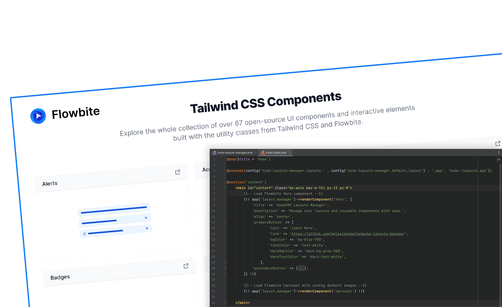

# HydePHP Layouts Manager

**Simplify layout and component management in your HydePHP projects.**

HydePHP Layouts Manager is a powerful package designed to simplify the management of layouts and reusable components in your [HydePHP](https://hydephp.github.io/) projects. It provides an intuitive way to organize and customize themes, layouts, and components, enhancing your workflow while keeping your codebase clean and maintainable.



**Check it out:** [HydePHP Layouts Manager](https://hydephp.melasistema.com)

## 🌟 Features

-   **Dynamic Layout Management**: Easily switch and manage layouts across your HydePHP site.

-   **Reusable Components**: Build modular, customizable components with default attributes.

-   **CLI Tools**: Automate common tasks like listing layouts and merging configuration files.

-   **Built-in Flowbite Support**: Includes pre-designed components using the [Flowbite](https://flowbite.com/) library.

-   **Customizable Themes**: Modify and extend default layouts and styles.


## 🛠️ Installation

### 1. Install via Composer

Use Composer to add the package to your project:

```bash
composer require melasistema/hyde-layouts-manager
```

----------

### 2. Publish the Configuration

Publish the package's configuration file to your app's `config` directory for customization:

```bash
php hyde vendor:publish --provider="Melasistema\HydeLayoutsManager\HydeLayoutsManagerServiceProvider" --tag="hyde-layouts-manager-config"
```

----------

### 3. Merge Tailwind Configuration

#### **Manual Merge**

Manually include the Layouts Manager configuration in your `tailwind.config.js` file:

```javascript
const HydeLayoutsManagerConfig = require('./tailwind-layouts-manager.config.js');
    
    module.exports = {
       darkMode: 'class',
       content: [
           './resources/views/**/*.blade.php',
           './vendor/hyde/framework/resources/views/**/*.blade.php',
           ...HydeLayoutsManagerConfig.content,
       ],
       theme: {
           extend: {
               ...HydeLayoutsManagerConfig.theme.extend,
           },
       },
    };
```

#### **Automated Merge**

Automate the process with the `tailwind:merge` command. This replaces your existing `tailwind.config.js` file with the default configuration from HydeLayoutsManager.

**⚠️ Warning:** This will overwrite your existing file. Back it up if you have custom configurations.

Run the command:

```bash
php hyde tailwind:merge`
```

----------

### 4. Install Required JavaScript Dependencies

The default theme and components shipped with HydeLayoutsManager use **Flowbite**. You can add these dependencies manually or by using the `package-json:merge` command.

#### **Manual Installation**

Add the following Flowbite dependencies to your `package.json` file:

```json
"devDependencies": {
  "flowbite": "^2.5.2"
}
```

Then, install the dependencies:

```bash
npm install
```

#### **Automated Merge**

Use the `package-json:merge` command to automatically merge the Flowbite dependencies into your existing `package.json`.

**⚠️ Safe in Fresh Projects:** This command modifies your `package.json`. Ensure to back it up if you have custom dependencies.

Run the command:

```bash
php hyde package-json:merge
```

Afterward, run:

```bash
npm install
```

----------

### 5. Add Flowbite Styles and Scripts to Laravel Mix Webpack

Add Flowbite styles and scripts in you `webpack.mix.js` file:

```js
let mix = require('laravel-mix');

mix.css('node_modules/flowbite/dist/flowbite.css', 'app.css')
    .js('node_modules/flowbite/dist/flowbite.js', 'app.js')
    .js('resources/assets/app.js', 'app.js')
    .postCss('resources/assets/app.css', 'app.css', [
        require('tailwindcss'),
        require('autoprefixer'),
    ])
    .setPublicPath('_site/media')
    .copyDirectory('_site/media', '_media')
```

----------

### 6. Modify the @extends Directive 

Add dynamic @extends() directive to your pages for the "Theme Switching" es. `index.blade.php`:

```php
@php($title = 'Home')

@extends(config('hyde-layouts-manager.layouts.' . config('hyde-layouts-manager.default_layout') . '.app', 'hyde::layouts.app'))

@section('content')
// page content
@endsection
```

----------

### 7. (Optional) Publish Views

If you want to customize the default views, publish them to your application:

```bash
php hyde vendor:publish --provider="Melasistema\HydeLayoutsManager\HydeLayoutsManagerServiceProvider" --tag="hyde-layouts-manager-views"
```

----------

### Final Steps

After completing the installation, you’re ready to build dynamic layouts and reusable components with **HydePHP Layouts Manager**! 🎉

----------

## 🧩 Usage

### Setting the Default Layout

Edit the `default_layout` option in the configuration file:

```php
'default_layout' => 'melasistema', // Or 'hyde' for the default Hyde layout
```

### Customizing Layouts

Layouts are defined in the `layouts` section of the configuration file. Each layout can have different views, styles, scripts, and navigation settings:

```php
'layouts' => [
    'melasistema' => [
        'app' => 'vendor.hyde-layouts-manager.layouts.melasistema.app',
        'page' => 'vendor.hyde-layouts-manager.layouts.melasistema.page',
        'post' => 'vendor.hyde-layouts-manager.layouts.melasistema.post',
        'styles' => 'vendor/hyde-layouts-manager/css/melasistema/app.css',
        'scripts' => 'vendor/hyde-layouts-manager/js/melasistema/app.js',
    ],
],
```

## 📋 Example Project Structure

Below is an example of how your project could be structured after installing the package:

```plaintext
my-hyde-project/
├── config/
│   └── hyde-layouts-manager.php
├── resources/
│   └── views/
│       └── vendor/
│           └── hyde-layouts-manager/
│               ├── components/
│               │   └── hero.blade.php
│               └── layouts/
│                   └── melasistema/
│                       └── app.blade.php
└── tailwind-layouts-manager.config.js`
```
----------


### 🧩 Using Components

Components are reusable UI elements with configurable defaults. The package provides two ways to use components in your Blade templates.

----------

#### **1. Using `@include`**

You can use the Blade `@include` directive to render components with default or customized data:

```php
@include('vendor.hyde-layouts-manager.components.hero', [
    'title' => 'Welcome to My Site',
    'description' => 'This is a customizable hero component.',
])
```

While this approach is straightforward and supports simple customizations, we encourage using the `renderComponent()` method for better flexibility and configuration management.

----------

#### **2. Using `renderComponent()`**

The `renderComponent()` method, provided by the `Hyde Layouts Manager`, dynamically renders components with the ability to override default configurations. Here's an example:

```php
{!! app('layout.manager')->renderComponent('hero', 
    [
    'title' => 'Welcome to My Amazing Site',
    'description' => 'This hero component is fully customizable.',
    'primaryButton' => [
        'text' => 'Get Started',
        'link' => '/start',
        ],
    ]) 
!!}
```

This method fetches the component configuration from the `hyde-layouts-manager.php` configuration file, allowing you to:

1.  Define defaults for each component.
2.  Override settings dynamically at runtime.

----------

#### **3. Configuring Components**

You can customize default settings for components in the `hyde-layouts-manager.php` configuration file under the `components` key. For example:

```php
'components' => [
    'hero' => [
        'view' => 'vendor.hyde-layouts-manager.components.hero',
        'default' => [
            'bgColor' => 'bg-white',
            'darkBgColor' => 'dark:bg-gray-900',
            'padding' => 'py-16',
            'textColor' => 'text-gray-900',
            'darkTextColor' => 'dark:text-white',
            'title' => 'HydePHP Layouts Manager',
            'description' => 'Manage your layouts and reusable components with ease.',
            'align' => 'center',
            'primaryButton' => [
                'text' => 'Learn More',
                'link' => '/learn-more',
                'bgColor' => 'bg-blue-700',
                'textColor' => 'text-white',
            ],
            'secondaryButton' => [
                'text' => 'Get Started',
                'link' => '/start',
                'bgColor' => 'bg-gray-100',
                'textColor' => 'text-indigo-500',
            ],
        ],
    ],
],
```

----------

#### **Benefits of `renderComponent()`**

-   **Dynamic Overrides:** Easily override defaults for individual component instances.
-   **Centralized Configuration:** Maintain consistent default values in the configuration file.
-   **Flexibility:** Simplifies reusability for components across projects.

----------

By leveraging these methods, you can build scalable and easily customizable layouts with HydeLayoutsManager. 🎉

### CLI Tools

The package includes several Artisan commands to streamline your workflow:

-   **List Layouts**: Display available layouts:

    ```php
    php hyde layouts:list
    ```

-   **Merge Package JSON**: Merge dependencies into your `package.json`:

    ```php
    php hyde package-json:merge
    ```

-   **Merge Tailwind Config**: Merge Tailwind configurations into your `tailwind.config.js` file:

    ```php
    php hyde tailwind:merge
    ```


## Customization

### Adding New Layouts

You can add custom layouts by defining them in the `layouts` section of the configuration file and placing the corresponding Blade templates in `resources/views/vendor/hyde-layouts-manager`.

### Overriding Default Components

To customize components, publish the views and edit the files in `resources/views/vendor/hyde-layouts-manager/components`.

### Dynamic Branding (with shipped default MelaSistema layout)

Customize navigation branding by setting the `navigation.brand` options in the configuration file:

```php
'navigation' => [
    'brand' => [
        'type' => 'image', // options: 'text', 'image', 'custom'
        'url' => '/',
        'lightLogo' => 'media/hyde-layouts-manager/logo/logo-navigation-light.png',
        'darkLogo' => 'media/hyde-layouts-manager/logo/logo-navigation-dark.png',
        'logoHeight' => 'h-10',
    ],
],
```

## 🌟 Credits

This project is made possible by the inspiration, contributions, and tools of an incredible community. A heartfelt thank you to:

-   **👨‍💻 Author**: [Luca Visciola](https://github.com/melasistema) – Passionate developer and creator of Hyde Layouts Manager. Reach out at [info@melasistema.com](mailto:info@melasistema.com) for inquiries or feedback.

-   **🚀 Inspired by HydePHP**: The foundation of this project stems from the brilliance of [Caen De Silva](https://github.com/caendesilva). Discover the magic of static site generation at [HydePHP GitHub](https://github.com/hydephp/hyde).

-   **🎨 Boosted by Flowbite**: This package features beautiful UI components and layouts, made even better with tools from [Flowbite](https://flowbite.com/).


### 🙌 Special Thanks

To the open-source community and all contributors—your dedication and collaboration inspire innovation and make tools like


## 📝 License

This package is licensed under the MIT License. See the [LICENSE](./LICENSE.md) file for details.

----------

## 💡 Contributing

We welcome contributions! Feel free to open an issue or submit a pull request on [GitHub](https://github.com/melasistema/hydephp-layouts-manager).

----------

## Support

If you encounter any issues or have questions, please open an issue on [GitHub](https://github.com/melasistema/hydephp-layouts-manager).